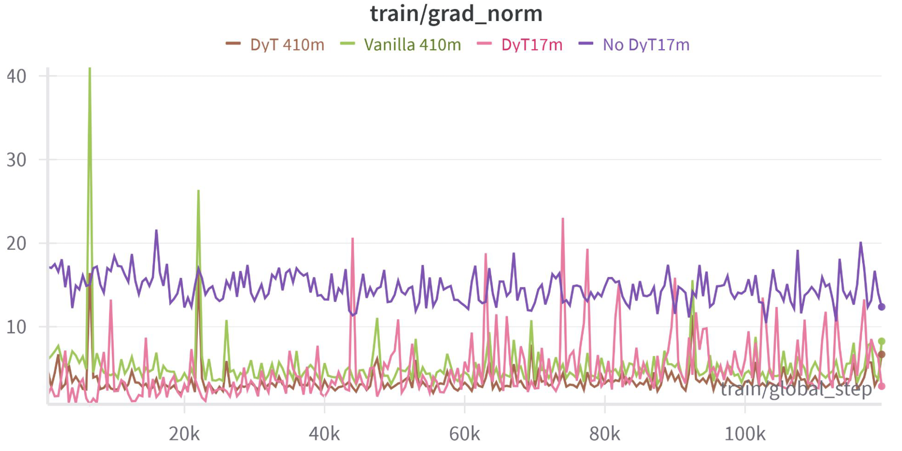
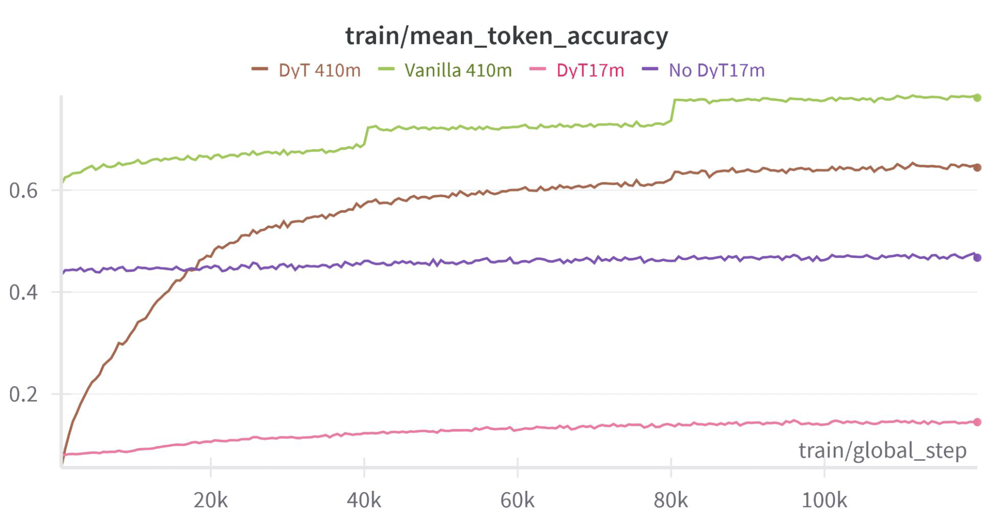

# Fine-Tuning LLMs Without Normalization Layers: A DyT-Based Approach Using RE-WILD

This repository contains the codebase, results, and plots for our final project in **ECE-GY 9143: High-Performance Machine Learning (HPML)** at NYU.

**Team:**

* Richard Zhong ([rhz2020@nyu.edu](mailto:rhz2020@nyu.edu))
* Gopala Krishna Abba ([ga2664@nyu.edu](mailto:ga2664@nyu.edu))

---

## Problem Overview

Post-training large LLMs is computationally expensive, and normalization layers like LayerNorm add complexity to training and inference. We investigate whether these layers can be replaced with a simpler alternative — **Dynamic Tanh (DyT)** — while maintaining performance.

---
## Motivation
- **Challenge**: Fine-tuning large LLMs is expensive and normalization layers like LayerNorm add architectural and runtime complexity.
- **Goal**: Explore whether **DyT (Dynamic Tanh)** can replace LayerNorm and still allow effective post-training.
- **Setup**: DistilGPT2 + PEFT (LoRA), trained across Alpaca, ShareGPT, and RE-WILD datasets.

---
## Key Contributions

* Replaced all `LayerNorm` layers in DistilGPT2 and Pythia with a learnable **Dynamic Tanh (DyT)** activation: `DyT(x) = tanh(\alpha x)`
* Integrated **LoRA (Low-Rank Adaptation)** via HuggingFace PEFT to enable parameter-efficient fine-tuning
* Explored:

  * Fully frozen DyT
  * **Selective unfreezing** of DyT layers
  * **Full supervised fine-tuning (SFT)**
* Fine-tuned and evaluated across **Alpaca**, **ShareGPT**, and **RE-WILD** datasets

---

## Experimental Setup

**Models:**

* DistilGPT2 (80M)
* Pythia 410M (limited due to memory)

**Frameworks:**

* HuggingFace Transformers
* PEFT (LoRA)
* Colab Pro and NYU HPC (A100)

**Datasets:**

* Alpaca: Small-scale instruction tuning (\~52k)
* ShareGPT: Medium-scale real dialogue (\~90k)
* RE-WILD: Open-ended QA (\~35k used due to constraints)

**Logged:**

* Training and validation loss per 500 steps
* Perplexity
* Prompt response outputs
* Inference time (Vanilla vs DyT)

---

## Key Results

| Dataset  | DyT Val Loss | Vanilla Val Loss | Loss Gap |
| -------- | ------------ | ---------------- | -------- |
| Alpaca   | \~8.3        | \~1.5            | 🔺6.8    |
| ShareGPT | \~8.3        | \~2.3            | 🔺6.0    |
| RE-WILD  | \~8.3        | \~0.9            | 🔺7.4    |

* **Inference Time**: DyT = 77.05s, Vanilla = 77.46s → \~0.5% speedup
* **Prompt Quality**: DyT generates literal, unstructured completions; vanilla preserves instruction-following and formatting better
---

## Repository Structure
```bash
├── data_utils/                # Dataset preprocessing, e.g. ShareGPT JSON
├── notebooks/                # Training notebooks for all setups
├── scripts/                  # Executable training scripts (.py)
├── results/                  # Saved checkpoints
├── plots/                    # Visualizations and graphs
├── report/Presentation.pdf   # Final submitted report
└── README.md                 # You're here
```

---
##  Architecture


---
## Experimental Results

### 1. RE-WILD (Selective DyT Unfreezing)

%20vs%20Vanilla.png)

> DyT with selective unfreezing showed stagnated validation loss (~8.3), while vanilla continued to converge. Suggests DyT struggles under LoRA on high-entropy datasets.

---

### 2. ShareGPT


> DyT (blue/orange) converges slower, with higher loss than vanilla. Simulated vanilla training reaches ~2.0 loss with stable gradients, demonstrating the benefits of LayerNorm.

---

### 3. Alpaca


> On a smaller instruction corpus, DyT retains basic convergence but exhibits noisy gradients and wider generalization gap compared to vanilla.

---

### 4. MT-Bench Inference Comparison


> DyT showed **0.5% faster inference** but drastically reduced preference on MT-bench judged outputs.

---

### 5. Pythia 410M: Train Loss


> Larger models benefit more from DyT. Loss offset between DyT and vanilla reduces with model scale.

---

### 6. Gradient Norm (Pythia)



> DyT introduces smoother gradients compared to noisy LayerNorm-free baselines, but requires tighter α tuning.

---

### 7. Token Accuracy



> Vanilla maintains higher accuracy over training, but DyT still improves token-level predictions, especially in larger models.
---

## Repository Structure

```
DyT-NoNorm-LLMs-REWILD/
├── notebooks/               # Jupyter notebooks for each experiment
├── scripts/                 # Training scripts (vanilla, DyT, selective unfreeze)
├── data_utils/              # Tokenizer, formatting, and dataset cleaning
├── results/                 # Raw loss logs and saved metrics
├── plots/                   # All graphs used in our report & slides
├── report/                  # Presentation slides (HPML_Presentation.pdf)
└── README.md
```

---

## How to Run

Install requirements:

```bash
pip install -r requirements.txt
```

Train a DyT-modified DistilGPT2 model on RE-WILD:

```bash
# Install requirements
pip install -r requirements.txt

# Train on Alpaca with Vanilla DistilGPT2
python scripts/train_alpaca_distillgpt2_vanilla.py

# Train on RE-WILD with DyT
python scripts/train_selective_unfreeze_rewild.py
```
---

## Dependencies
- `transformers`
- `datasets`
- `peft`
- `torch`
- `scipy`, `matplotlib`, `numpy`
---

## Observations

* DyT struggles to generalize without normalization layers, especially on larger, diverse corpora like RE-WILD
* Selective unfreezing helps, but performance gap remains significant
* Vanilla DistilGPT2 shows clean convergence; DyT plateaus at high loss
* Full SFT improves DyT, but undermines PEFT advantages

---

## Slides & Report

* [📄 HPML Final Slides (PDF)](./report/Presentation.pdf)

---

## Future Work

* Try DyT with **LLaMA 3.2B** using larger batch sizes
* Evaluate DyT with alternative norm-replacement functions
* Integrate DyT into **quantized** or **sparsely activated** LLMs

---
##  Acknowledgements
- HuggingFace Transformers & Datasets
- Colab Pro for GPU access
- HPML course instructors for project guidance

---

## License
This project is part of academic coursework at NYU and released for research and educational use only.

---

## Contact

For questions or collaborations, reach out to:

* Richard Zhong: [rhz2020@nyu.edu](mailto:rhz2020@nyu.edu)
* Gopala Krishna Abba: [ga2664@nyu.edu](mailto:ga2664@nyu.edu)
